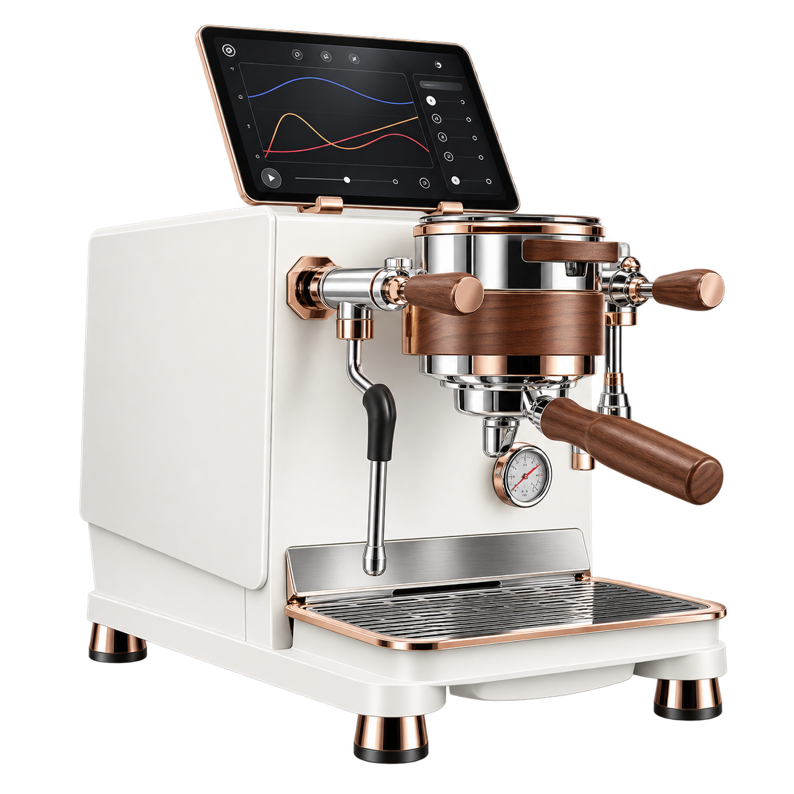

# WENDOUGEE DATA S · Home Assistant

Local-first espresso-machine telemetry and opt-in controls over Bluetooth Low Energy for the **WENDOUGEE DATA S**. Controls are experimental and require attended commissioning.

[](https://github.com/bdini13/wendougee-data-ha/actions/workflows/validate.yml)
[](#project-status)
[](#machine-controls)
[](docs/HOME_ASSISTANT.md)
[](LICENSE)
[](AI_DISCLOSURE.md)

[Setup guide](docs/HOME_ASSISTANT.md) · [Espresso dashboard](docs/DASHBOARD.md) · [Capability map](CAPABILITIES.md) · [Control design](docs/CONTROL_DESIGN.md) · [Roadmap](ROADMAP.md) · [Protocol](docs/protocol.md) · [AI disclosure](AI_DISCLOSURE.md)



> [!WARNING]
> **Experimental integration.** Version 0.2.0 adds opt-in machine controls.
> Routine polling defaults to 30 seconds; bounded private traces have sustained
> 2 Hz telemetry/state pairs for three idle minutes. Physical comparisons and
> shot-transition validation remain pending. Boiler schedules are planning helpers;
> schedules do not run automatically. Control transactions are simulation-tested,
> not yet physically commissioned. Do not use these sensors as safety interlocks.

Latest evidence, **September 26, 2026**: 360/360 paired samples at 2.003 Hz,
8 Hz in a separate short telemetry-only test, and 28 validated passive FF55 events.
The apparent proxy regression was a missing advertisement subscription in the
diagnostic harness; both tested ESPHome versions worked after correction.
See the [live record](docs/LIVE_VALIDATION_2026-09-21.md) for measurements and
the [autonomous feature audit](research/AUTONOMOUS_AUDIT_2026-09-26.md) for new
upstream findings, including terminal-shot timing and app-local device naming.

## What it does

- Discovers connectable `WDG_Data_*` machines through **Home Assistant's shared Bluetooth stack**.
- Requires confirmation before starting periodic read-only telemetry requests.
- Separately opts into independent brew/steam boiler switches and a guarded button
  for the currently selected stored mode-2 shot profile. Setup never activates them.
- Version 0.1.0 registers 30 read-only entities: the original 23 telemetry/configuration/state entities plus observed shot/cleaning activity, persistent observed totals and last-event timestamps.
- Opens a short connection for each poll and disconnects afterward; default interval is 30 seconds.
- Makes measurements unavailable after a failed read and starts a fresh session on a later poll.
- Rejects unexpected responses and arbitrary commands; cleans up after partial setup, cancellation and unload.
- Strictly validates both documented FF55 event-frame families and narrowly decodes the exact-machine periodic opcode-`0x83` binary marker without assigning semantics, constructing commands or changing the HA read transport. A 60-second event-only capture decoded all 19 alternating frames and measured an approximately six-second same-marker period.
- Exports allowlisted diagnostics without device addresses, names, hashes or raw packets. Version 0.0.9 added UTC poll-health evidence; 0.1.0 adds identifier-free observed-activity state and its lower-bound limitation.
- Offers a separately confirmed one-shot action for the four fixed private evidence reads.
- Version 0.1.2 corrects the bounded read-only benchmark to exclude proxy connection setup from sampling time, use the normal 15-second session timeout, and test 1 → 2 → 5 → 10 Hz. It returns privacy-safe stage diagnostics even when no rate passes. The benchmark and private trace action serialize telemetry/state reads, require the literal confirmation `READ ONLY`, never retry an uncertain transaction, and expose no control command.
- Includes a built-in-card Espresso dashboard with latest readings, recent activity, daily shot/water trends, maintenance history and inert boiler schedule planning helpers. An Evidence & capture tab explains measured rates, trace collection and remaining limits.

**No runtime cloud account, AI service or manufacturer backend is required.** Initial dependency installation may require internet access. Normal polling reads telemetry and operating state together; every twentieth poll also refreshes configuration and water-alarm-enable state. A separate approval-gated HA action returns the same four fixed read-only responses as the private evidence CLI; it exposes no arbitrary request or control path.

## Machine controls

**This installation:** independent brew/steam switches are enabled. The requested
**paddle-bound shot trigger remains disabled and unimplemented**: upstream stores
it separately from the app-selected recipe, and its remote activation is not yet
verified. The Espresso dashboard explicitly marks it pending; no substitute shot
button is shown. See [the paddle-binding evidence](docs/PADDLE_PROFILE.md).

In **Settings → Devices & services → WENDOUGEE DATA S → Configure**, independently
enable boiler control and stored-profile start. Both options default off.

- **Brew boiler / Steam boiler:** explicit on/off, fresh idle check, exact response
  echo and complete configuration readback. No temperature or other setting writes.
- **Start stored profile:** uses the profile already selected in the machine/app,
  **not necessarily the paddle-bound profile**. Requires brew enabled, no reported
  water alarm, supported mode 2 and fresh idle state. It neither selects nor uploads
  a recipe. Be at the machine with portafilter and cup ready; reaching temperature
  is not verified. This optional app-profile control is **not** the requested
  paddle trigger and remains disabled on this installation.
- A start with uncertain outcome locks further starts across reloads/restarts.
  Physically check the machine, then use `wendougee_data.acknowledge_profile_uncertainty`
  with `MACHINE CHECKED`; a fresh idle read is also required. Never retry blindly.

The underlying shot command is a start/stop toggle, so no remote stop button or
automatic retry is exposed. HA's `button.press` invokes the optional app-profile
entity directly once enabled; there is no service-level physical-presence check.
Do not enable it as a substitute for paddle execution or automate shot starts.
Boiler schedules remain inert.
See [control behavior and commissioning limits](docs/CONTROL_DESIGN.md).

### Available entities

| Measurement | Unit | Default |
|---|---|---|
| Brew / steam temperature | °C | Enabled |
| Pump pressure | bar | Enabled |
| Pumped volume | mL | Enabled |
| Flow rate | mL/s | Disabled pending unit validation |
| Scale weight / weight rate | g / g/s | Disabled pending accessory validation |
| Elapsed brew time / pump active time | s | Disabled pending timing validation |
| Water shortage | Problem | Enabled; not a safety interlock |
| Reachable | Connectivity | Enabled; represents the last poll |
| Boiler enable settings / water-alarm detection | Boolean | Disabled pending physical comparison |
| Boiler targets / heating mode | °C / enum | Disabled pending physical comparison |
| Manual time / pressure settings | s / bar | Disabled pending physical comparison |
| Cleaning time / rest / repetitions | s / count | Disabled pending physical comparison |
| Operating state | Enum | Disabled pending transition observation |
| Observed shot/cleaning activity | Binary | Enabled; lower bound at the configured poll cadence |
| Observed shot/water totals | Count / mL | Enabled; persistent lower-bound totals for HA statistics |
| Last observed shot/backflush | Timestamp / mL | Enabled; updates only when the corresponding transition is observed |

All readings remain provisional until physical comparison. Pumped volume is not cup yield, and pump pressure is not necessarily puck pressure. The default polling interval can miss an entire shot. The separate, explicitly invoked private trace action is intended for attended evidence collection; routine entities remain **basic monitoring, not a continuous shot-graph recorder**. Seventeen provisional measurement, configuration and state entities are disabled by default, not removed.

## Project status

| Area | Evidence / status |
|---|---|
| Local DATA S transport | GATT discovery, four allowlisted reads, proxy firmware comparison and bounded paired-read soak verified |
| Physical value comparison | Pending; the native-helper reading was not compared with the machine display |
| Python protocol and session layer | Implemented; synthetic fixtures, fake-transport tests and exact-machine passive FF55 framing evidence |
| Evidence collection | One private four-read HA-proxy baseline completed; sanitized results documented, physical comparison pending |
| HA integration | 0.2.0 installed; independent boiler switches opted in; app-profile start opted out; requested paddle trigger pending |
| Verification baseline | **193 local tests passing:** 145 protocol/package + 48 HA tests, as of 2026-09-26 |
| Tested HA environment | Framework tests: HA 2026.9.3 / Python 3.14.7; target host is HA 2026.9.1 with 0.2.0 files installed through the ESPHome-proxy deployment path |
| Deployment / release | 0.2.0 installed after a fresh full backup, archive verification and configuration check; telemetry recovered after restart; not a published HACS release |
| Device controls | 0.2.0 opt-in boiler switches and stored mode-2 profile start; simulation-tested, attended hardware commissioning pending |

The earlier hardware read used a native CoreBluetooth helper. The later HA-proxy baseline validates this integration's read path, but not calibration, unattended reliability or any control path. See the [sanitized live-validation record](docs/LIVE_VALIDATION_2026-09-21.md) and [60-item capability map](CAPABILITIES.md) for limits, source revisions, conflicts and unknowns.

The CI badge reports GitHub's workflow status, not an assertion that unpublished local changes have already passed remote CI.
Documentation-only commits intentionally skip CI; use manual dispatch for a full
run on demand. Code, dependency, dashboard and workflow changes still run both
test environments. See [contributing and CI policy](CONTRIBUTING.md).

## Build and installation

### Build without touching hardware

From a checkout, using Python 3.13 or newer:

```sh
python scripts/build_integration.py
```

Output: `dist/wendougee_data.zip`, containing `custom_components/wendougee_data/`, the original protocol modules and the MIT license. The build does not scan, connect to the machine, or deploy to Home Assistant.

The generated `_protocol/` directory and ZIP are deliberately ignored by Git. Their source and build recipe are committed. **Do not install only the tracked component directory:** it omits the generated protocol bundle.

### Install only for an approved test

1. Read the [HA setup and limitations guide](docs/HOME_ASSISTANT.md), confirm version compatibility and back up the HA configuration.
2. Inspect any existing component directory before extracting the ZIP into the HA configuration directory; do not blindly overwrite an existing installation.
3. Restart HA and add **WENDOUGEE DATA S** through Settings → Devices & services.
4. Disconnect E-Bar/other Bluetooth clients, prepare an attended validation session, and explicitly confirm read-only polling.

HA needs a connectable Bluetooth path to the machine. The target HA host has now used its ESPHome proxy for discovery, polling and one four-read baseline. Other HA versions, proxy hardware/firmware combinations and Wendougee models remain unverified. Disable or remove the integration to stop polling.

For a headless HA host with no available web session, adding an empty
`wendougee_data:` section to `configuration.yaml` is an explicit polling opt-in.
On restart, import succeeds only when HA already sees exactly one supported
connectable machine; zero or multiple matches fail closed. Remove the YAML
section before removing the imported entry if it must stay removed.

An approved headless evidence session can add `capture_baseline: true` beneath
that section. HA creates an attempt marker before the first complete four-read
refresh, then writes those already validated responses to an owner-only private
file. Restarts cannot repeat a failed or uncertain raw capture; routine
read-only polling still continues on its documented cadence.

## Roadmap

- [x] Research existing implementations and document protocol provenance.
- [x] Build the independent read-only protocol/session layer and capability map.
- [x] Implement offline-tested HA discovery, sensors, recovery, diagnostics and packaging.
- [ ] Complete physical comparison of the decoded readings and direct-Python lifecycle validation on the actual DATA S.
- [ ] Complete extended HA disconnect/contention/disable soak testing and review a minimal sanitized fixture for publication.
- [x] Add provisional read-only configuration and operating-state entities, disabled by default.
- [x] Add persistent observed shot/water/backflush analytics and a built-in-card Espresso dashboard.
- [x] Add offline-tested, approval-gated sampling benchmark and private bounded trace capture.
- [x] Complete a controlled second-proxy A/B test and correct the diagnostic harness's missing proxy-ownership subscription.
- [x] Complete a rollback-safe ESPHome 2026.7.2/2026.9.0 matrix on Proxy 2; both versions connect and return valid telemetry, and Proxy 2 is restored to 2026.9.0.
- [x] Add strict passive decoding for the locally observed opcode-`0x83` FF55 marker without exposing a command path.
- [x] Complete a three-minute 2 Hz paired-read idle soak with all 360 samples returned.
- [ ] Validate the selected high-rate sampling cadence and one manually initiated shot through the actual ESPHome proxy.
- [ ] Complete the installed official-app feature inventory.
- [ ] Introduce narrowly scoped controls: settings first, profile upload/readback next, attended brewing/cleaning last.
- [x] Add opt-in boiler enable switches and guarded app-selected stored-profile infrastructure (0.2.0); enable only boiler switches on this installation.
- [ ] Resolve and validate the specifically requested paddle-bound shot trigger; do not substitute the app-selected recipe.
- [ ] Finish release hardening, compatibility documentation and HACS packaging/validation.

The [detailed roadmap](ROADMAP.md) defines acceptance gates rather than promising dates or “100% support.” Calibration, raw valves, reset and OTA are not ordinary integration features and remain outside the initial control roadmap.

## Architecture

```text
HA discovery + confirmed setup
            │
            ▼
Polling coordinator → shared Bluetooth adapter → DATA S
            │           bounded read session; disconnect
            ▼
Independent protocol validation and telemetry decoding
            │
            ▼
Read-only entities + redacted diagnostics
```

The source protocol package has no HA dependency. The build bundles only named original modules; it excludes the standalone BLE scanner. After a timeout or uncertain response, the session refuses further reads and requires a fresh connection. Modbus RTU lacks transaction IDs, so same-shaped unsolicited responses remain a protocol limitation. Telemetry and operating state are read sequentially; they are not an atomic snapshot, especially at a shot boundary.

## Development and checks

Keep the environments separate: the standalone client and HA use different Bleak dependency versions.

**Protocol/CLI — Python 3.13**

```sh
python3.13 -m venv .venv313
.venv313/bin/python -m pip install -e ".[test]"
.venv313/bin/python -m pytest
.venv313/bin/python -m ruff check .
.venv313/bin/python -m ruff format --check .
.venv313/bin/python -m compileall -q src custom_components tests scripts
```

**Home Assistant — separate Python 3.14 environment**

```sh
python3.14 -m venv .venv-ha
.venv-ha/bin/python -m pip install -r requirements-ha-test.txt
.venv-ha/bin/python scripts/build_integration.py
.venv-ha/bin/python -m pytest -c pytest-ha.ini
```

HA tests exercise the real framework with simulated Bluetooth and network sockets disabled. The CI workflow runs protocol and HA jobs separately. Passing tests do not establish hardware safety. Use test-driven development for behavior changes, preserve source provenance, and add fixtures before expanding the protocol allowlist.

## Documentation and issue labels

| Document | Purpose |
|---|---|
| [HA guide](docs/HOME_ASSISTANT.md) | Entities, installation, polling and compatibility limits |
| [Espresso dashboard](docs/DASHBOARD.md) | Current/recent shots, daily trends, maintenance and inert schedule planning |
| [Capability map](CAPABILITIES.md) | Known, implemented, conflicting and unknown functions |
| [Control design](docs/CONTROL_DESIGN.md) | Boiler write evidence, transaction invariants and scheduling safety boundary |
| [Validation plan](docs/VALIDATION_PLAN.md) | Efficient test batches and evidence requirements |
| [Evidence collection](docs/EVIDENCE_COLLECTION.md) | Private fixture schema, capture scope and review boundary |
| [Offline core](docs/OFFLINE_CORE.md) | Framing, session behavior and failure policy |
| [Protocol reference](docs/protocol.md) | BLE/Modbus observations and candidates |
| [Upstream inventory](research/UPSTREAM_SOURCES.md) | Pinned sources and license boundaries |
| [Autonomous feature audit](research/AUTONOMOUS_AUDIT_2026-09-26.md) | New upstream findings, private replay results and next evidence gaps |
| [Contributing](CONTRIBUTING.md) | Development checks, CI scope, labels and dashboard deployment |
| [Contributor/agent handoff](CODEX_HANDOFF.md) | Implementation history and safety constraints |

[Issue-label definitions](.github/labels.json) group work by area, evidence and risk—for example `area:protocol`, `area:home-assistant`, `needs:hardware-validation`, and `safety`. All 14 catalog labels are available on the [GitHub repository](https://github.com/bdini13/wendougee-data-ha/labels), including `area:dashboard` and `area:ci` added on 2026-09-26; existing labels were preserved. When reporting a bug, include software/firmware versions, expected versus observed behavior and sanitized diagnostics. Never post credentials or raw captures publicly.

## AI disclosure

This project has been developed with **substantial AI assistance**, including Codex and Hermes, for research, implementation, tests, review assistance, documentation and the original machine illustration above. The maintainer directs the work and authorizes hardware access; this does not imply independent human review of every generated line. Automated tests and AI review are not substitutes for physical validation or an independent safety review.

AI is used in development, **not in the integration's runtime**. See [AI_DISCLOSURE.md](AI_DISCLOSURE.md) for scope, limitations and accountability.

## Privacy, attribution and license

Raw captures, device-specific Bluetooth addresses/names, credentials, tokens, APKs and local HA state must stay out of commits and public reports. Diagnostics use an explicit allowlist; third-party debug logs still need manual review before sharing. Device IDs are address-derived hashes, not a guarantee of anonymity or stability across address changes.

Protocol research builds on [GeeFlow](https://github.com/drobekk/GeeFlow), [LitaLite](https://github.com/dallonby/LitaLite), [Crema](https://github.com/dallonby/Crema) and [DecentEbar](https://github.com/akiskev/DecentEbar). This project's Python implementation is independently written; upstream code with GPL, PolyForm or absent licensing is not bundled. See the [research inventory](research/UPSTREAM_SOURCES.md) for attribution and reuse boundaries.

Original project code is licensed under [MIT](LICENSE). This is an unofficial community project, not affiliated with or endorsed by Wendougee or Home Assistant.
